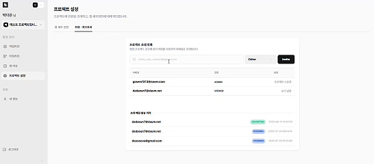
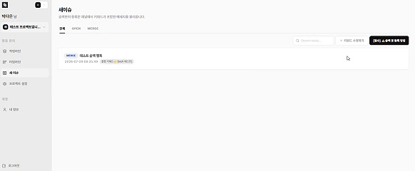
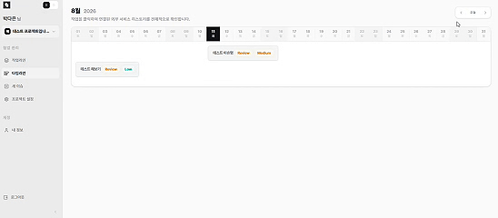
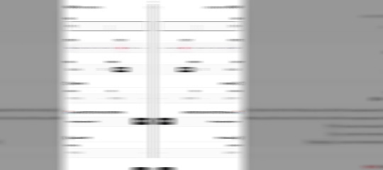
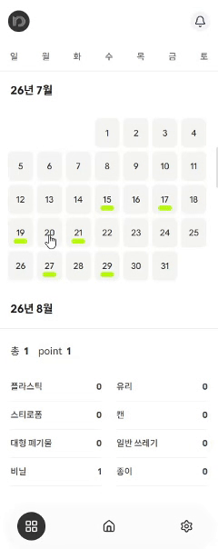

# 안녕하세요, 박다은입니다.

지표를 바탕으로 백엔드 성능을 최적화하고 가용성 높은 비동기 환경과 인프라를 구축하는 풀스택 개발자입니다.

## ▪️ Live & Contact
- **Portfolio:** https://main.daeun-tech.site
---

## ▪️ Tech Stack

- **Backend:** Java, Spring Boot, Spring WebFlux, R2DBC, Python, FastAPI
- **Database & Cache:** PostgreSQL, Redis
- **Data & Event:** Apache Kafka, Spring Task Scheduler, async_playwright
- **Infrastructure & DevOps:** AWS Lightsail, Docker, Docker Compose, Traefik, Linux

---

## ▪️ Current Projects

### 1. Connect (B2B SaaS 통합 타임라인 서비스)
> 분산된 B2B SaaS(Slack, GitHub, Figma, Notion)의 웹훅 및 API 데이터를 하나의 타임라인으로 통합 수집하는 서비스입니다.
> 
> **[👉 Connect GitHub 저장소 바로가기](https://github.com/dadaeun7/connect)**

#### 📸 주요 시연 기능
| 프로젝트 초대 및 권한 관리 | 외부 서비스 메시지 이슈 수집 |
| :---: | :---: |
|  |  |
| 이메일 기반 팀원 초대 및 Role(ADMIN/VIEWER) 관리 | Slack 등 외부 연동 메시지 감지 및 자동 이슈화 |

| 통합 타임라인 뷰 | 작업 라인(Workline) 추적 |
| :---: | :---: |
|  |  |
| 외부 서비스 작업 내역을 날짜별 캘린더별 조회와 상세 이벤트 내역 확인 | 이슈를 추가하고 하위 관리할 외부 이벤트를 관리 |

#### ⚙️ 주요 핵심 역량
- **OAuth 통합 및 데이터 보안:** Keycloak Identity Broker 기반 인증 통합 및 Redis를 활용한 토큰/세션 AES 암호화 관리
- **DB 스키마 설계:** PostgreSQL 유니크 제약키(Unique Constraint) 및 1:N 관계 정의로 외부 데이터 중복 인입 차단
- **비동기 이벤트 버퍼링:** API Rate Limit 대응을 위한 Spring Task Scheduler 제어 및 Kafka 메시지 큐 기반 트래픽 완충 파이프라인 구축
- **성능 최적화 및 가용성 검증:** Netty 기반 Spring WebFlux + R2DBC 환경에서 k6 부하 테스트를 진행하여 커넥션 풀 최적화 (100 VU 동시 접속 환경에서 **요청 실패율 0.00%**, **p(95) 263.6ms** 검증)

---

### 2. Reclever (AI 기반 분리배출 추천 파이프라인)
> 비정형 커머스 영수증 데이터를 연동하여 분리배출 가이드라인을 제공하는 LLM/머신러닝 기반 자동 분류 파이프라인
> 
> **[👉 Reclever GitHub 저장소 바로가기](https://github.com/dadaeun7/reclever)** 

#### 📸 주요 시연 기능
| Gmail 영수증 연동 메인 UI | 일자별 배출 통계 및 포인트 |
| :---: | :---: |
|  |  |
| 커머스 영수증 연동 및 분리배출 기록 관리 | 일자별 품목 배출 내역 통계 및 포인트 조회 |

#### ⚙️ 주요 핵심 역량
- **Traefik Reverse Proxy & Docker:** 서버 환경에 직접 Docker Compose를 구동하고 Traefik 리버스 프록시를 적용해 서비스 간 동적 라우팅 및 SSL 관리 자동화
- **알고리즘 정제 및 스코어 정상화:** 자카드(Jaccard) 알고리즘의 분모 비대화 문제를 포착하여 Containment 공식 및 정규식 필터링으로 전환 (9,819개 데이터 정제, 매칭 스코어 **0.00x → 0.25~0.3** 정상화)
- **비동기 수집 & AI 파이프라인 구축:** `async_playwright` 기반 비동기 스크래핑으로 5만 건의 실데이터 수집을 자동화하고, NVIDIA API(`google/diffusiongemma-26b-a4b-it`) 및 Ollama 연동을 통한 분리배출 라벨 정제 진행 중
- **모니터링 및 검증:** Python FastAPI Swagger UI를 통한 대화형 입력 검증 및 Docker 컨테이너 로그 모니터링 기반 예외 처리 체계 구축

---
